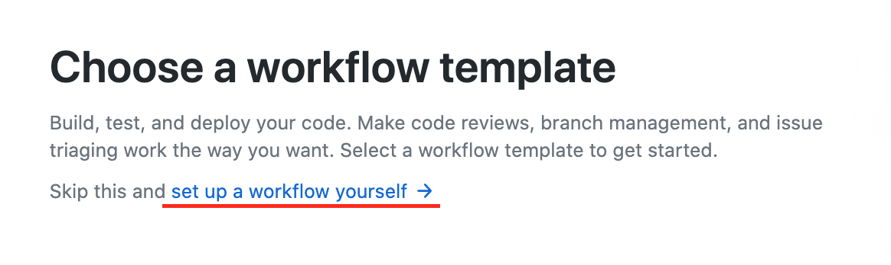

# Welcome to the AH CI/CD with Github Actions hands-on session.

# Exercise 1:
### Fork this repository
For this hands-on session you'll need some boilerplate code that we created for you. This ensures that you can focus on the CI/CD components instead of on irrelevant problems. To make your own copy of this repository you should fork it! A fork is a copy of a repository. Forking a repository allows you to freely experiment with changes without affecting the original project.

Fork this repository to your **personal** Github account. **Note**: We work on our personal accounts without any company data so that are in full control. For more information on how to fork a Github repository, check out:

<https://docs.github.com/en/free-pro-team@latest/github/getting-started-with-github/fork-a-repo>

---
# Exercise 2:
### Run pytest and pre-commit on your machine
This repository contains a sample Python based project. We've added a few tests in the tests directory. We'll now focus on running both PyTest and pre-commit. You will typically run your tests and pre-commit _before_ pushing your code to the repository. We can reuse the knowledge from this step for the next exercise.
- Install pre-commit and run [pre-commit](https://pre-commit.com/) on the repository
- Use pytest to run the tests in this directory

---
# Exercise 3:
### Write your first Github Actions Workflow file that runs pre-commit and pytest
Now that you managed to run pre-commit and tests on your machine, it's time to set up a build in Github Actions. To create a workflow in Github Actions, go to the repository, click on Actions, click New Workflow and use the option to set up a workflow yourself. You will need to perform the same procedure as on your local machine (exercise 2), but this time in GitHub Actions. 

You might want to check the extensive [documentation]( https://docs.github.com/en/free-pro-team@latest/actions) for help on syntax and definitions. It can be handy to add the **workflow_dispatch** to your triggers, so that you can manually trigger the CI.

**Hint**: update your setup.py file to include pre-commit and pytest so you can use pip install in your CI to install the things that you need.

---
# Exercise 4:
### Update your Workflow file so that it triggers a test & build when the acceptance branch receives a new commit.
We're now directly working on Master (or Main), it's often desired to separate Acceptance and Master. Make an extra branch and update the workflow. If you've updated the workflow, add some code to acceptance and push it, see if everything works as planned.

---
# Exercise 5:
### Update your Github Actions YAML file so that it triggers a test & build when a pull request is initiated from acceptance to master.
Merging changes into master is often done via pull requests. On the enterprise Github account provided by Albert Heijn, you may set various branch policies. One of these policies is that pushing to master is not allowed. To merge changes into a protected master branch, you must set up a pull request with optional reviewers. Let's update our workflow so that the CI is triggered once we receive a pull request on master.

Once you've set this up. Merge your acceptance changes into master using a pull request and see if you can build your application.

